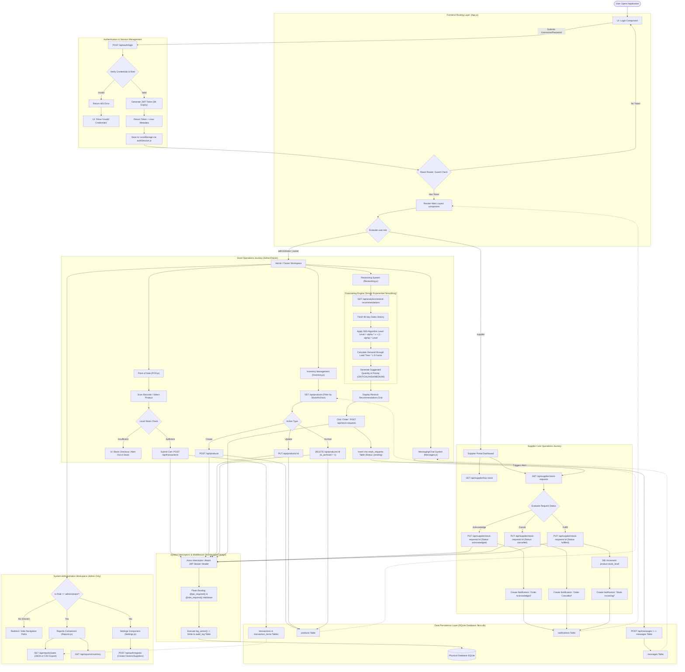

# FLECS

**F**orecasting and **L**ogistics **E**nterprise for **C**onvenience **S**tores — a web-based decision support system for independent retailers. FLECS ties together point-of-sale, inventory control, demand-based restocking, supplier workflows, and optional AI-assisted inventory Q&A.

## Features

| Role | Capabilities |
|------|----------------|
| **Owner** | Dashboard analytics, POS checkout, product CRUD, restock recommendations, stock requests to suppliers, in-app messaging, inventory AI chat |
| **Administrator** | Everything the owner has, plus sales/inventory reports (JSON/CSV), user registration, system settings |
| **Supplier** | Low-stock overview, view and process stock requests (acknowledge, cancel, fulfill), notifications |

**Restocking engine** — Uses 90 days of sales history and Simple Exponential Smoothing (SES) to suggest order quantities with priority labels (CRITICAL, HIGH, MEDIUM).

**Inventory assistant** — Optional chat powered by OpenRouter; answers natural-language stock questions when `OPENROUTER_API_KEY` is set.

## Tech stack

| Layer | Technologies |
|-------|----------------|
| Frontend | React 18, React Router, Axios, Recharts |
| Backend | Flask, Flask-JWT-Extended, Flask-CORS |
| Database | SQLite (`backend/flecs.db`) |
| Forecasting | SES (configurable alpha via `FLECS_SES_ALPHA`) |
| AI (optional) | OpenRouter API |

## Project structure

```
FLECS/
├── backend/
│   ├── app.py              # Flask API and business logic
│   ├── flecs.db            # SQLite database (created on first run)
│   ├── requirements.txt
│   └── .env.example
├── frontend/
│   ├── src/
│   │   ├── App.js          # Routes and role guards
│   │   ├── api.js          # Axios client and interceptors
│   │   └── components/     # UI modules (POS, Inventory, etc.)
│   ├── package.json
│   └── build/              # Production bundle (after npm run build)
└── concept_summary.md      # Technical documentation (local reference)
```

## Getting started

### Prerequisites

- Python 3.10+
- Node.js 18+

### Backend

```bash
cd backend
pip install -r requirements.txt
cp .env.example .env    # optional; required for AI chat
python app.py
```

The API listens on `http://localhost:5000`. On first run, the app creates `flecs.db`, seeds demo products, and ensures default accounts exist.

### Frontend

```bash
cd frontend
npm install
npm start
```

The dev server runs on `http://localhost:3000` and proxies API calls to port 5000 (`package.json` proxy).

### Default accounts

| Username | Password | Role |
|----------|----------|------|
| `admin` | `admin123` | administrator |
| `owner` | `owner123` | owner |

Change these credentials before any production deployment.

## Configuration

Copy `backend/.env.example` to `backend/.env`:

| Variable | Description |
|----------|-------------|
| `OPENROUTER_API_KEY` | API key for inventory chat |
| `OPENROUTER_MODEL` | Primary model (`auto`, `llama`, `gemma`, `deepseek`, `qwen`, or full model id) |
| `OPENROUTER_MODEL_FALLBACKS` | Comma-separated fallback models |
| `FLECS_SES_ALPHA` | SES smoothing factor (default `0.35`) |

`.env` files are gitignored. Do not commit secrets.

## Production build

```bash
cd frontend
npm run build
```

Serve `frontend/build` with a static file host. Point the client at the Flask API URL your deployment uses.

## Architecture flowchart

End-to-end request flow: authentication, role routing, store/supplier operations, middleware, and persistence.


